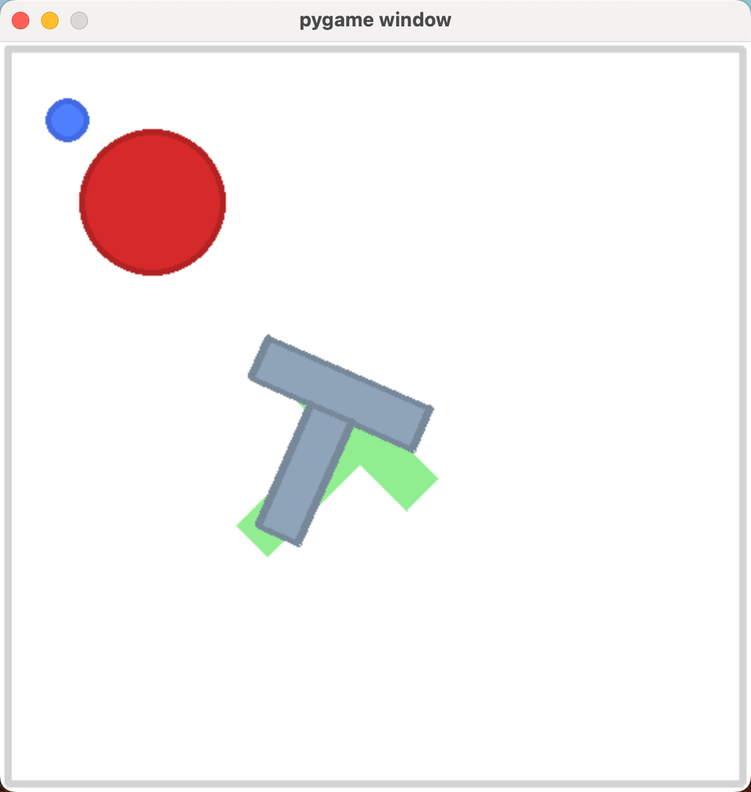

# gym-pusht
A gymnasium environment PushT with obstacle.



## Installation

Create a virtual environment with Python 3.10 and activate it, e.g. with [`miniconda`](https://docs.anaconda.com/free/miniconda/index.html):
```bash
conda create -y -n pusht python=3.10 && conda activate pusht
```

## Dependencies
Install gym-pusht and zarr:
```bash
pip install gym-pusht zarr
```

## Usage

**PushT Rule:**

The goal of the agent is to push the block to the goal zone. The agent is a circle and the block is a tee shape. Start with the mouse hovering over the blue dot. Press R to reset the environment. Press Q to quit.

**PushT with obstacle Rule:**

Same as PushT, but red obstacles are present. The environment will be reset when the blue dot touches the obstacle. Failed data will not be recorded.

`play.py` and `play_obs.py` are pushT and pushT with obstacle playgrounds.

`collect.py` and `collect_obs.py` are data collection scripts, the datasets and videos will be saved in the `outputs` folder.

**How to run:**

```bash
conda activate pusht
python play.py # play pushT
python play_obs.py # play pushT with obstacle
python collect.py # collect data for pushT
python collect_obs.py # collect data for pushT with obstacle
```


## Acknowledgment

gym-pusht-obstacle is adapted from [Diffusion Policy](https://diffusion-policy.cs.columbia.edu/) and [gym-pusht](https://github.com/huggingface/gym-pusht).
